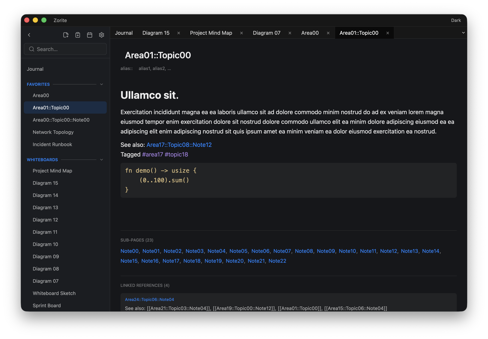

<p align="center">
  
</p>

# Zorite

[](https://github.com/packetThrower/zorite/actions/workflows/ci.yml)
[](https://github.com/packetThrower/zorite/releases/latest)
[](https://github.com/packetThrower/zorite/releases)
[](https://github.com/microsoft/winget-pkgs/tree/master/manifests/p/packetThrower/Zorite)
[](Cargo.toml)
[](https://www.gpui.rs/)
[](LICENSE)

## Minimum OS versions

**macOS** (Apple Silicon and Intel)

[](#install)
[](#install)
[](#install)

**Windows** (x64 and ARM64)

[](#install)

**Linux** (amd64 and arm64)

[](#install)
[](#install)
[](#install)
[](#install)

Linux additionally needs a Vulkan-capable GPU with current Mesa drivers.

A local-first, Logseq-style **daily journal** for the desktop — but with a
**Word-like** typing experience rather than an outliner. Notes are Markdown in a
local SQLite database; link them with `[[wiki-links]]`, embed and annotate PDFs,
drop in images, sketch on freeform **whiteboards**, and search across
everything. No cloud, no account — your notes stay on your machine. Built in Rust
with [gpui](https://www.gpui.rs/) (Zed's GPU-accelerated UI framework) +
[gpui-component](https://github.com/longbridge/gpui-component).

Developed in close collaboration with Claude (Anthropic).

<p align="center">
  <picture>
    <source media="(prefers-color-scheme: dark)" srcset="docs/public/screenshots/zorite-macos-dark.png">
    <source media="(prefers-color-scheme: light)" srcset="docs/public/screenshots/zorite-macos-light.png">
    
  </picture>
</p>

📝 [**Changelog**](CHANGELOG.md) · 🗺️ [**Roadmap**](TODO.md)

## Highlights

- **Daily journal feed** — an infinite, reverse-chronological stream of days
  (today on top, older days lazy-loaded as you scroll). Each day is a single
  Markdown document; click in (or right-click → **Edit**) to edit the raw text,
  click away and it re-renders. No "filling out a form" feel — every line is just
  editable text, and clicking the rendered page drops the caret where you clicked.
- **`[[wiki-links]]`, `#tags`, and backlinks** — clickable in the rendered view,
  they navigate to (and auto-create) pages and power a "Linked References" panel.
  Name a page `Projects::Tasks` to nest it with `::`; the sidebar shows the
  namespace tree and each page lists its sub-pages. A subdued `alias::` field
  takes alternate names, so `[[hen]]` can resolve to your `chicken` page.
- **Whiteboards** — a freeform infinite canvas alongside the text journal: a
  freehand pen, shapes (rectangle, ellipse, line, arrow, diamond, triangle,
  rounded-rectangle, star, hexagon), on-canvas text, dropped/pasted images, and
  **page-card embeds** that link back to notes. Select/move/resize/rotate one
  element or a group; per-element colour, fill, gradient, and opacity; z-order;
  snap-to-grid; copy/paste across boards; and **reusable templates**. Boards are
  first-class pages with their own sidebar section, searchable by title.
- **`/` command palette** — a compact menu: pick **Markdown** (headings, lists,
  to-dos, quotes, code blocks, **tables**, dividers, inline formatting) or a
  **Template**, or insert the current date/time with `/date` / `/time`. Typing
  filters across everything; click an item or press Enter to insert it.
- **As-you-type completion** — `[[` suggests pages (and offers to create one),
  `#` suggests tags, `{{` suggests template placeholders; brackets and quotes
  auto-pair (prose-aware, so `don't` is left alone).
- **Full-text search**, **type-aware** — a trigram FTS5 index over titles and
  content, with results that also include the PDF and image *files* and the
  whiteboards referenced in your notes. Filter by a `pdf:` / `img:` / `wb:` /
  `page:` prefix or a results-pane chip (each with a live count).
- **Tabs & multiple windows** — open pages, PDFs, and boards in tabs (the journal
  is the pinned first tab). **Drag a tab** to reorder it, drop it on another
  window to move it there, or release it on empty space to **tear it off into a
  new window**. Every window is independent and edits **sync live** across all of
  them.
- **Inline images** — `` images render for real; **paste** or
  **drag-and-drop** a file to add one (copied into the data dir's `images/`),
  and drag the corner handle to resize (saved as `{width=N}`).
- **PDF viewer** — link a PDF with `[[file.pdf]]` / `` or drop one
  onto a note to open it in a dedicated **page-virtualized** viewer tab (only
  pages near the viewport are rasterized; scrolled-away pages free their memory
  *and* GPU texture, so an 800-page document stays light). Zoom, page navigation,
  DPI-aware rendering, a TOC, **drag-to-highlight** markup with note↔PDF jump
  links, and **password-protected** PDFs (RC4 / AES). Pure-Rust
  [`hayro`](https://crates.io/crates/hayro), no native dependencies — the
  reusable [`gpui-pdf`](crates/gpui-pdf/README.md) crate.
- **Markdown rendering** — CommonMark + GFM (headings, bold/italic/code, lists,
  quotes, tables, strikethrough, `<mark>` highlights) and **Mermaid diagrams**
  (flowchart / sequence / class, rendered pure-Rust and themed to your skin;
  click one to expand it) — via the [`gpui-markdown`](crates/gpui-markdown/README.md)
  crate. **Find in page** searches the rendered text with highlight and count.
- **Import from Logseq** — `File → Import from Logseq…` brings in a graph's
  pages, journals, and assets (namespaces, tasks, properties, aliases, embeds,
  block-refs, and `hls__*` PDF-highlight pages all handled), plus its
  **whiteboards** (tldraw boards → native Zorite boards, images and all) and
  **favorites**.
- **Sidebar** — collapses to a slim icon rail; a **Favorites** group (right-click
  a page → *Add to favorites*), a calendar that jumps to any date, collapsible
  sections, and a recently-viewed page tree with namespace nesting.
- **Local SQLite** storage for notes; images and PDFs live beside it as files.
  Everything stays on your machine.

## Templates

Create a page named `Templates` and define snippets with `!name` headers — every
line under a `!name` (until the next `!name`) is that template's body:

```text
!meeting
## Meeting {{date}}
- Attendees:
- Notes: {{cursor}}

!standup
- Yesterday:
- Today:
- Blockers:
```

Then type `/meeting` in any day or page to insert it. Placeholders expand on
insert: `{{date}}`, `{{time}}`, `{{title}}` (the current page/day), and
`{{cursor}}` (where the caret lands). Built-in Markdown commands live in
[`gpui-markdown`](crates/gpui-markdown/README.md) as `SNIPPETS`.

## Themes

Zorite ships several built-in themes (Zorite, Nord, Solarized, Dracula, Tokyo
Night, Foundry, Cyberpunk, E-Ink), each with a light and dark variant (Cyberpunk
is dark-only). Open **Settings** (the ⚙ in the title bar) to pick a theme and
choose **Light / Dark / Auto** (Auto follows your system appearance). A quick
light/dark toggle also lives in the title bar.

Drop a `.json` file in your themes folder (Settings → **Reveal themes folder**)
and click **Reload**. Any color you omit falls back to the base palette, so a
theme can be just a few colors:

```json
{
  "id": "midnight",
  "name": "Midnight",
  "dark": {
    "bg_window": "#0d1117",
    "bg_sidebar": "#161b22",
    "bg_content": "#0d1117",
    "fg": "#e6edf3",
    "accent": "#ff7b72",
    "tag": "#d2a8ff",
    "code": "#79c0ff"
  },
  "light": { "accent": "#0969da" }
}
```

Tokens (each `#RRGGBB`): `bg_window`, `bg_sidebar`, `bg_content`, `fg` (text),
`accent`, `tag`, `code`. Provide a `dark` and/or `light` block. Add
`"dark_only": true` for an always-dark theme.

## Install

> Installer packages land with the first **stable** release. Until then, grab a
> build from the [Releases](https://github.com/packetThrower/zorite/releases)
> page — every beta attaches `.dmg`, `.exe`/`.msi`, `.deb`, `.AppImage`, `.rpm`,
> and `.pkg.tar.zst` artifacts plus `SHA256SUMS`.

On macOS and Windows, the package managers track the latest stable tag and get
you past the first-launch Gatekeeper / SmartScreen warnings.

```sh
# macOS — Homebrew
brew install --cask packetThrower/tap/zorite        # stable
brew install --cask packetThrower/tap/zorite@alpha  # pre-release

# Windows — winget (Microsoft's package manager, preinstalled)
winget install packetThrower.Zorite                 # or: winget install zorite

# Windows — Scoop
scoop bucket add packetThrower https://github.com/packetThrower/scoop-bucket
scoop install zorite                                # stable
scoop install zorite-prerelease                     # pre-release
```

winget carries **stable only**; for pre-release builds on Windows use Scoop or
the [Releases](https://github.com/packetThrower/zorite/releases) page directly.
Linux users grab the matching `.deb` / `.rpm` / `.AppImage` / `.pkg.tar.zst`
from Releases (`pacman -U` for the Arch package).

To install by hand, download from Releases and drag `Zorite.app` to
`/Applications` on macOS, or run the installer on Windows. The macOS builds are
ad-hoc signed, so the first launch needs a right-click → **Open** (or
`xattr -cr Zorite.app`); the Windows installer is unsigned, so SmartScreen needs
**More info → Run anyway**. Notarized macOS and signed Windows builds are planned
— see [TODO.md](TODO.md).

## Building from source

A small Rust workspace (the app plus three reusable crates).

```sh
git clone git@github.com:packetThrower/zorite.git
cd zorite
cargo run                       # debug build + launch
cargo build --release           # optimized binary at target/release/zorite
cargo test --workspace          # run the tests
```

The first `cargo build` compiles gpui's full dependency graph and takes a few
minutes; incremental builds are fast. Toolchain: a recent stable Rust (via
[rustup](https://rustup.rs/)). Platform libraries:

- **macOS**: Xcode command-line tools (`xcode-select --install`).
- **Debian / Ubuntu**: `sudo apt install libxkbcommon-dev libxkbcommon-x11-dev libwayland-dev libx11-dev libxcb1-dev libxcb-randr0-dev libxcb-xkb-dev libxcb-cursor-dev libxcb-shape0-dev libxcb-xfixes0-dev libxcb-render0-dev libfontconfig1-dev libfreetype-dev pkg-config`
- **Windows**: nothing extra; the gpui DirectX backend ships with Windows 10+.

Your data lives at:

| OS      | Path                                                   |
| ------- | ------------------------------------------------------ |
| macOS   | `~/Library/Application Support/zorite/zorite.db`       |
| Linux   | `$XDG_DATA_HOME/zorite/` (or `~/.local/share/zorite/`) |
| Windows | `%APPDATA%\zorite\`                                     |

`ZORITE_DATA` overrides the whole data directory (and `ZORITE_DB` just the
database file), so you can run against a throwaway data set without touching your
real notes.

## Workspace layout

```
zorite/
├── src/                       the app — journal feed, pages, search, slash menu, import, SQLite
└── crates/
    ├── gpui-markdown/         a reusable Markdown renderer for gpui (clickable links, Mermaid)
    ├── gpui-pdf/              a page-virtualized PDF viewer (pure-Rust hayro) with highlight markup
    └── gpui-whiteboard/       a host-agnostic infinite-canvas whiteboard
```

Each crate is host-agnostic and carries its own README.

## Performance

Zorite stays responsive with large note collections. The numbers below come from
synthetic databases built by [`scripts/gen_perf_db.py`](scripts/gen_perf_db.py)
— a 3-level `Area::Topic::Note` namespace tree with `[[wiki-links]]`, inline
images, and a couple weeks of journal days. `ZORITE_DB` points the app at a
throwaway database, so your real notes are never touched:

```sh
python3 scripts/gen_perf_db.py 10000 /tmp/zorite-perf.db
ZORITE_DB=/tmp/zorite-perf.db cargo run
```

**Hot-path query timings** (SQLite, best of several runs on a development Mac):

| Operation                                | 1,000    | 10,000   | 50,000   |
| ---------------------------------------- | -------- | -------- | -------- |
| Load the page list (`list_pages`)        | 0.3 ms   | 4.4 ms   | 26 ms    |
| Search per keystroke (FTS5 trigram)      | 0.07 ms  | 0.11 ms  | 0.09 ms  |
| Backlinks for a page (indexed)           | 0.005 ms | 0.005 ms | 0.005 ms |
| Seed the recent list (first launch only) | 0.1 ms   | 2.3 ms   | 12 ms    |

`list_pages` loads only `id`/`title`, not page content — keeping it fast and
memory flat. Search is a **trigram FTS5 index**, so it stays ~0.1 ms whether
you have a thousand pages or fifty. **Memory** (resident set size):

| Metric                       | Empty DB | 10,000 pages | 50,000 pages |
| ---------------------------- | -------- | ------------ | ------------ |
| RAM (RSS)                    | ~86 MB   | ~135 MB      | ~138 MB      |
| Database file (incl. index)  | 60 KB    | 48 MB        | 229 MB       |

RAM barely moves from 10k to 50k: the page list holds only `id`/`title` (~2 MB at
50k), not the note bodies — those load one page at a time as you open them. The
database file grows mostly with the FTS trigram index. At 50,000 pages, launch,
navigation, search, and scrolling all stay immediate, and the sidebar's cost is
independent of the total (it's capped to recently-viewed pages).

## License

[GNU General Public License v3.0 or later](LICENSE). Forks are welcome;
derivative works must stay open under the same license. Commercial use is
permitted but can't close the source.
